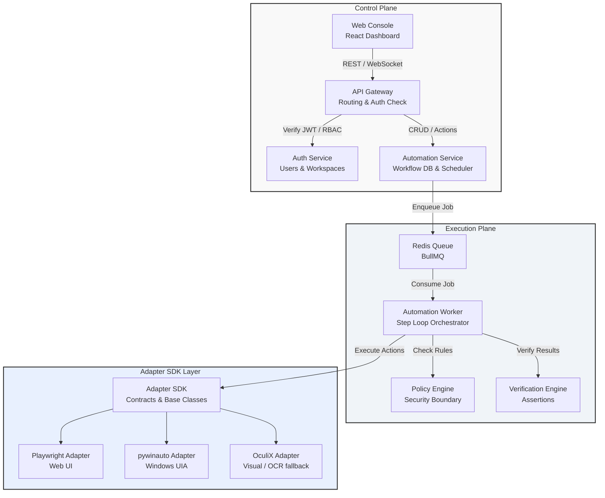

# System Architecture Specification — Automation OS

This document defines the high-level architecture of **Automation OS**, detailings its planes of operation, service boundaries, packages, and technical decisions.

## 1. Architectural Concept

Automation OS is organized around a strict decoupling of the **Control Plane**, **Execution Plane**, **Adapter SDK Layer**, and the **Observability / Evidence Interfaces**.



---

## 2. Core Architectural Planes

### 2.1 The Control Plane
The Control Plane is responsible for management, schema definitions, access control, and scheduling. It does not perform actual automation actions.
* **API Gateway:** Serves as the single entrypoint for the frontend and external clients. Handles routing, SSL termination, rate-limiting, and error mapping.
* **Auth Service:** Authenticates users via password hashing, issues and validates JWT tokens, and manages workspace memberships (multi-tenancy isolation).
* **Automation Service:** Manages the relational state (via SQLite) of Workspaces, Applications, Workflows, Versions, Executions, and Policies. Houses the cron-based scheduler.

### 2.2 The Execution Plane
The Execution Plane processes commands asynchronously to isolate long-running operations from the synchronous HTTP request-response cycle.
* **Redis Queue & BullMQ:** Manages the job backlog. Supports concurrency controls, delay-retries, prioritization, and cancellation.
* **Automation Worker:** Consumes execution jobs from the queue. Implements the core State Machine to step through workflows, perform policy validation before each step, retrieve ephemeral credentials, invoke the correct adapter, and verify the outcome.

### 2.3 The Adapter SDK Layer
Decouples implementation technologies (like Playwright, pywinauto, or OculiX) from the orchestrator.
* **Unified Interface:** Adapters are wrappers that implement a standardized TypeScript interface (`IAutomationAdapter`) defined by the `adapter-sdk`.
* **Zero Engine Leakage:** The core engine never imports vendor-specific modules (e.g., `playwright` or `pywinauto`). It communicates with adapters using standardized arguments (`target`, `action`, `timeout`, etc.) and expects standardized outputs (`ActionResult`, `Evidence`).

### 2.4 The Verification and Policy Layers
* **Policy Engine:** Checks if an action is allowed based on active system policies (e.g., file system restrictions, banned websites, credential read boundaries).
* **Verification Engine:** Evaluates if a step succeeded by executing a checking routine (such as finding a control, matching a visual template, or calculating a file checksum).

### 2.5 The Artifact Layer
* **Artifact Service:** Receives files, screenshots, and logs from execution workers.
* **Storage Abstraction:** Supports local filesystem directories during local development and S3/MinIO protocols in cloud-ready deployments.

---

## 3. Package and Monorepo Structure

We organize the monorepo using npm/pnpm workspaces to ensure strict dependency limits and avoid code duplication:

```
automation-os/
├── apps/
│   ├── web/                     # React + Vite Client
│   └── gateway/                 # Express API Gateway
│
├── services/
│   ├── auth-service/            # Auth logic
│   ├── automation-service/      # Main workflow orchestrator REST API
│   └── artifact-service/        # Binary asset/screenshot manager
│
├── workers/
│   └── automation-worker/       # BullMQ Job runner
│
├── adapters/
│   ├── playwright-adapter/      # Playwright browser integration
│   ├── pywinauto-adapter/       # Python-based pywinauto bridge
│   ├── oculix-adapter/          # Visual search adapter
│   └── robot-adapter/           # Robot Framework runner
│
└── packages/
    ├── shared-types/            # Unified TS interfaces and database schemas
    ├── shared-utils/            # Logging, error mapping, string redaction
    ├── config/                  # Standard configuration parsing (Zod-driven)
    ├── workflow-engine/         # Finite State Machine definitions
    ├── adapter-sdk/             # Base adapter and contract interfaces
    ├── policy-engine/           # Rule verification engine
    ├── verification-engine/     # Action & State validators
    ├── event-contracts/         # Publish/Subscribe message schemas
    └── testing/                 # Mocks (e.g. MockAutomationAdapter), test stubs
```

---

## 4. Internal Dependency Matrix

The following table summarizes compile-time import boundaries to guarantee high-quality separation of concerns:

| Package / App | Allowed Compile-Time Dependencies | Explicitly Forbidden Dependencies |
| :--- | :--- | :--- |
| **shared-types** | None | Any service or worker code |
| **shared-utils** | config, shared-types | database repositories, adapters |
| **config** | None | services, workers |
| **adapter-sdk** | shared-types, shared-utils | Playwright, pywinauto, OculiX |
| **workflow-engine** | shared-types, adapter-sdk, config, policy-engine, verification-engine | Specific adapters (e.g., playwirght-adapter) |
| **playwright-adapter** | adapter-sdk, shared-types | pywinauto, OculiX, workflow-engine |
| **pywinauto-adapter** | adapter-sdk, shared-types | Playwright, OculiX |
| **oculix-adapter** | adapter-sdk, shared-types | Playwright, pywinauto |
| **automation-worker**| workflow-engine, event-contracts, config, adapter-sdk | UI/Web console packages |
| **auth-service** | shared-types, config, shared-utils | workflow-engine, any adapter |
| **gateway** | shared-types, config | Database directly (must call services) |

---

## 5. Technology Baseline

* **Frontend:** React, Vite, TypeScript, Tailwind CSS, Zustand, React Router.
* **Backend:** Node.js (v18+), Express or Fastify.
* **Database:** SQLite (local-first storage accessed through clean Repository Abstraction).
* **Queuing:** Redis and BullMQ.
* **Validation:** Zod schemas.
* **Logging:** Pino/Winston formatted as structured JSON logs, carrying unique Request ID and Execution ID metadata.
