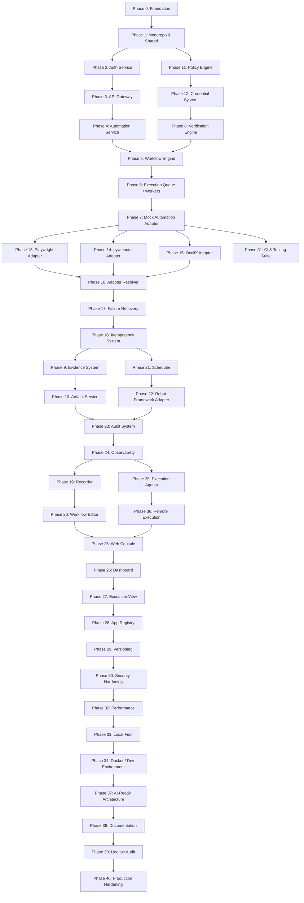

# Phase-by-Phase Roadmap — Automation OS

This document outlines the detailed sequence of steps required to build the Automation OS product from scratch. We detail each development phase, its purpose, deliverables, and validation criteria.

## Phase Dependency Graph

---

## Roadmap Phases

### Phase 0: Product Foundation
* **Goal:** Set up initial project structure, repositories, workspace definitions, architectural specifications, and initial configuration parameters.
* **Deliverables:** `.gitignore`, `README.md`, `docs/` containing PRD, Architecture, Security, Phase Roadmap, and Adapter architecture specs.

### Phase 1: Monorepo + Shared Foundation
* **Goal:** Create the monorepo root settings, package build configuration, and the shared packages.
* **Deliverables:** `package.json`, `tsconfig.json`, `packages/shared-types`, `packages/shared-utils`, `packages/config`, `packages/event-contracts`, and `packages/testing` utilities.

### Phase 2: Authentication Service
* **Goal:** Create `services/auth-service` to manage users, authentication, password policies, JWT token issues, and multi-tenant workspace separation.
* **Deliverables:** Express/Fastify service, repository abstraction for SQLite, registration, login endpoints, JWT issuance, and tests.

### Phase 3: API Gateway
* **Goal:** Build `apps/gateway` to handle incoming external and frontend traffic, verifying JWT tokens, appending Request-IDs, rate limiting, and mapping service paths cleanly.
* **Deliverables:** Gateway server with proxying routing to the auth service and future automation services.

### Phase 4: Automation Domain Service
* **Goal:** Implement the primary REST API layer for workflows, versions, schedules, and app registries.
* **Deliverables:** `services/automation-service` carrying workflow CRUD logic, validation schemas, and database migrations.

### Phase 5: Workflow Engine
* **Goal:** Build the core state machine that executes workflows deterministically.
* **Deliverables:** `packages/workflow-engine` exposing execution steps, state transitions (draft -> running -> verifying -> succeeded/failed), and dependency resolution.

### Phase 6: Execution Queue (Workers)
* **Goal:** Implement the worker logic (`workers/automation-worker`) using BullMQ/Redis to execute long-running automation workflows outside the HTTP flow.
* **Deliverables:** Worker processing logic, job registration, cancellations, priority, and exponential backoff configuration.

### Phase 7: Mock Automation Adapter
* **Goal:** Set up a test double adapter (`MockAutomationAdapter`) that simulates successful, failing, timeout, and low-confidence visual automation steps.
* **Deliverables:** Foundation of CI headless testing, which does not require real desktop UIs or environments.

### Phase 8: Verification Engine
* **Goal:** Implement `packages/verification-engine` to verify action state and post-conditions (such as checking if files were downloaded, if UI controls are visible, or matching OCR).
* **Deliverables:** Assertions verifying state transformations, matching, and calculations of checksums.

### Phase 9: Evidence System
* **Goal:** Build metadata collectors to save screenshot frames, DOM text, process outputs, and OCR results produced by actions.
* **Deliverables:** Log and snapshot tracking interfaces bound to the execution step pipeline.

### Phase 10: Artifact Service
* **Goal:** Create `services/artifact-service` to handle uploads, downloads, and lifecycle management of screenshots, recordings, and files.
* **Deliverables:** File management service with local filesystem storage (abstracted for future S3 integration).

### Phase 11: Policy Engine
* **Goal:** Implement `packages/policy-engine` to authorize or deny operations before they are dispatched (e.g. limit directories, permitted browsers, or dangerous executions).
* **Deliverables:** Rule evaluation engine, pre-execution verification routines.

### Phase 12: Credential System
* **Goal:** Create `CredentialProvider` to handle encrypted retrieval of secrets and inject them securely at the exact time of execution.
* **Deliverables:** Secret extraction logic with built-in logging sanitization (redaction of tokens/passwords).

### Phase 13: Playwright Adapter
* **Goal:** Integrate Playwright (`adapters/playwright-adapter`) to handle standard browser-based automation.
* **Deliverables:** Session isolation, target navigation, clicks, keystrokes, and screenshot integration.

### Phase 14: pywinauto Adapter
* **Goal:** Set up native Windows accessibility/UI automation capability via pywinauto.
* **Deliverables:** `adapters/pywinauto-adapter` acting as a Python-bridge execution agent for structured Win32/UIA elements.

### Phase 15: OculiX Adapter
* **Goal:** Implement visual automation fallbacks when there is no DOM or accessibility tree available.
* **Deliverables:** `adapters/oculix-adapter` wrapping template search, OCR target matching, and region definitions, with similarity verification.

### Phase 16: Adapter Resolver
* **Goal:** Build runtime routing to select the best adapter (API, DOM, Accessibility, or OculiX) for a task.
* **Deliverables:** Resolving rules mapping application targets to adapters with user-overridden preferences.

### Phase 17: Failure Recovery
* **Goal:** Create execution-level self-healing steps (re-connecting, refreshing browsers, restarting applications, switching selectors).
* **Deliverables:** Retry and recovery policies integrated into the step orchestrator.

### Phase 18: Idempotency System
* **Goal:** Ensure workflows can be retried safely without repeating side effects.
* **Deliverables:** Unique idempotency key checks, file checksum lookups, and transaction tracking.

### Phase 19: Automation Recorder
* **Goal:** Capture mouse clicks, typing, and element targeting to auto-generate draft workflows.
* **Deliverables:** Base architecture for coordinate-relative and selector tracking.

### Phase 20: Visual Workflow Editor
* **Goal:** Build web-based components to let users create, drag-and-drop, and edit steps.
* **Deliverables:** Editor screens with schema validation and validation state flags.

### Phase 21: Scheduler
* **Goal:** Provide scheduling triggers (crons, periodic delays, or completion events).
* **Deliverables:** Scheduler runtime registered within the Automation Service.

### Phase 22: Robot Framework Adapter
* **Goal:** Add Robot Framework suite execution.
* **Deliverables:** `adapters/robot-adapter` which maps Robot Framework outputs into Automation OS execution logs.

### Phase 23: Audit System
* **Goal:** Generate immutable, detailed transaction events for every administrative or execution state transition.
* **Deliverables:** Cryptographically-bound audit trail schemas and database storage routines.

### Phase 24: Observability
* **Goal:** Provide insights on job run times, success rates, bottleneck steps, and adapter utilization.
* **Deliverables:** Prometheus-compatible health metrics and Winston/Pino structured JSON logs.

### Phase 25 to 30: Web Console and Security Hardening
* **Goal:** Deliver React dashboards, execution details views, application registry managers, workflow version tracking, and workspace security rules.
* **Deliverables:** Full frontend console pages connected to API gateway, strict route guards, and SQL-injection prevention.

### Phase 31: Testing System (CI/CD)
* **Goal:** Establish a fast CI test cycle with mock adapters.
* **Deliverables:** Automated unit, integration, and contract tests running completely headlessly.

### Phase 32 to 34: Performance, Local-First, and Docker
* **Goal:** Streamline SQLite queries, virtualize lists, compile containers, and establish local-first SQLite/Redis profiles.
* **Deliverables:** Docker Compose configuration, lazy-loading endpoints, and garbage-collector tasks for files.

### Phase 35 to 37: Execution Agents, Remote Execution, and AI Planners
* **Goal:** Create modular lightweight agents running on remote systems (e.g. Windows machines) to process executions remotely, and interfaces for future AI planning modules.
* **Deliverables:** Agent heartbeat, capabilities advertisement, RPC/Queue listener, and `AutomationPlanner` interface definitions.

### Phase 38 to 40: Documentation, Compliance, and Production Hardening
* **Goal:** Write complete setup guides, perform a license compliance check, audit and redact logging keys, remove leftover TODO placeholders, and compile production assets.
* **Deliverables:** Multi-page documentation books, Third-party notices manifest, and verified production container compiles.
